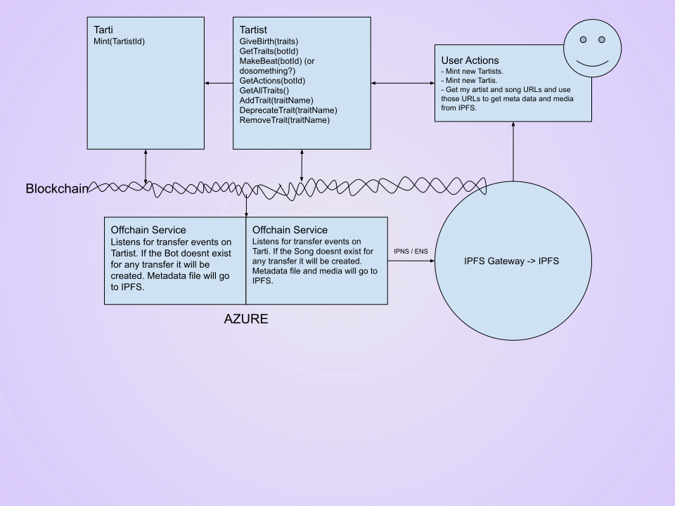

<h1 align="center">
  
</h1>

  Tarti
   
  <a href="#about"><strong>Explore the screenshots »</strong></a>
   
   
  <a href="https://github.com/evandelacruz/tarti/issues/new?assignees=&labels=bug&template=01_BUG_REPORT.md&title=bug%3A+">Report a Bug</a>
  ·
  <a href="https://github.com/evandelacruz/tarti/issues/new?assignees=&labels=enhancement&template=02_FEATURE_REQUEST.md&title=feat%3A+">Request a Feature</a>
  ·
  <a href="https://github.com/evandelacruz/tarti/issues/new?assignees=&labels=question&template=04_SUPPORT_QUESTION.md&title=support%3A+">Ask a Question</a>

 

 

Table of Contents

- [About](#about)
  - [Tartist](#tartist)
  - [Tarti](#tarti)
  - [Off-chain Interactions](#off-chain-interactions)
  - [Dapp](#dapp)
  - [System Diagram](#system-diagram)
  - [Token rights](#token-rights)
  - [Built With](#built-with)
- [Usage](#usage)
  - [Tartist](#tartist-1)
  - [Tarti](#tarti-1)
- [Roadmap](#roadmap)
- [Support](#support)
- [Project assistance](#project-assistance)
- [Contributing](#contributing)
- [Authors \& contributors](#authors--contributors)
- [Security](#security)
- [License](#license)
- [Acknowledgements](#acknowledgements)

---

## About

Tarti is made up of two smart contracts: [Tartist.sol](Tartist.md) and [Tarti.sol](Tartist.md).

### Tartist
Simply put, a Tartist is a bot. Presently, Tartists are all music producers.
A Tartist is also an NFT.
It is unique as an NFT in that it can create other NFTs.
The NFTs that Tartists create are called Tartis.

### Tarti
A Tarti is an NFT. As of now, Tartis are all music and related files.

### Off-chain Interactions
When a Tartist or Tarti is minted, an off chain service will create the related multimedia and store it on IPFS at tarti.eth, which will be linked by the NFTs metadata.

### Dapp
A Dapp to interact with these contracts can be found at [Github](http://github.com/evandelacruz/tartiweb)

### System Diagram

### Token rights
The copyrights for the art generated by a Tartist are automatically owned by whomever holds the Tartist token for that Tartist at the time the art is generated.
To designate ownership of a particular Tartist, a Tartist token can be held by an account on the Ethereum blockchain. The Tartist token is a fully compliant ERC721 Non Funglible Token (NFT).

When a Tartist generates art, they mint a Tarti token on the blockchain. This Tarti token lives in the Tarti smart contract and is automatically transferred to the owner of the Tartist token for the Tartist who generated the art. Therefor, the owner of a Tartist token will automatically inherit ownership of any Tarti tokens generated by the Tartist. When a Tartist token is sold/transferred, copyrights to any future pieces of art will belong to the new holder of the Tartist token.

Tartsists and Tartis can be transferred and/or sold on public marketplaces such as OpenSea.io like any other NFT.
Tartis can be transferred independent of Tartists.

### Built With

- Solidity
- OpenZepplin
- Truffle

## Usage

### Tartist

The Tartist contract expsoses these functions (in addition to standard ERC721 functions)
- `mintTo(address recipient)`
- `newArt(uint8 artistId)`

### Tarti

The Tarti contract expsoses these functions (in addition to standard ERC721 functions)
- `artByArtist(uint8 artistId, uint256 artOrdinal)`
- 
## Roadmap

Porting over from Jira soon...

## Support

Reach out to the maintainer at one of the following places:

- [GitHub issues](https://github.com/evandelacruz/tarti/issues)
- Contact options listed on [this GitHub profile](https://github.com/evandelacruz)

## Project assistance

- Mint a Bot!
- Add a [GitHub Star](https://github.com/evandelacruz/tarti) to the project.

## Contributing

These contracts will be deployed and immutable soon, but any help appreciated in the meantime.

## Authors & contributors

This repository is by [Evan de la Cruz](https://github.com/evandelacruz).

## Security

Tarti avoids re entrance attacks

## License

This project is licensed under the **MIT license**.

See [LICENSE](LICENSE) for more information.

## Acknowledgements

- OpenSea docs